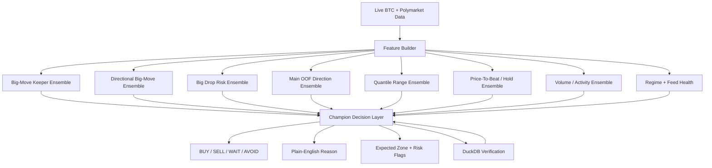

# Model Ownership And Champion Ensemble Plan

Date: 2026-06-17

Purpose: define which model should predict each part of the BTC decision system, how many small specialist ensembles the app should have, and how a final champion ensemble should validate every BUY / SELL / AVOID decision.

Implementation status: the first production-safe slice of this plan is now implemented and wired into the price-to-beat card:

| Priority | Status | Implementation |
|---|---|---|
| Extend `bigmove_keeper` | Implemented | `LogReg + RF + ExtraTrees + optional CatBoost` on 4 parity-safe keeper features |
| Add Big Drop Risk Head | Implemented | `train_bigdrop_keeper.py`, `price_to_beat.py`, card gauge |
| Add Probability Bucket Tables | Implemented | `head_probability_buckets.py`, `HEAD_PROBABILITY_BUCKETS_2026-06-17.md`, `data/head_probability_buckets.parquet` |
| Quantile Range Veto | Implemented in champion | `decision_champion.py` uses reward room and 80% band zone |
| Champion Decision Validator | Implemented | `decision_champion.py`, `rnd["champion"]`, UI verdict strip |
| Calibrated big-move / big-drop heads | Implemented | Isotonic calibration added to both trainer bundles |
| Separate live `big_up` / `big_down` heads | Implemented as confirmation only | `train_directional_keeper.py`, `directional_keeper_model.pkl`, live card rows |
| Activity/range specialist head | Implemented as activity proxy | `train_activity_keeper.py`, `activity_keeper_model.pkl`, live card row |
| Regime + skip rules | Implemented as rules-first gate | quiet activity, disagreement, directional conflict, regime flags |
| Champion meta-model layer | Data-gated implementation | `champion_snapshots`, `train_champion_meta.py`, optional runtime meta reject |
| Horizon-aware specialist heads | Implemented | `1m/3m/5m/7m/10m/15m/30m` models for big-move, big-drop, big-up/down, and activity |
| Horizon-aware big-move logic | Implemented as configurable bucket map | Default `BTC_MOVE_BUCKETS_USD_BY_HORIZON=1:10\|20\|40;3:20\|35\|70;5:30\|60\|100;7:40\|80\|140;10:50\|100\|180;15:60\|120\|300;30:100\|200\|600` |

Bucket meaning:

```text
quiet       < first boundary
meaningful >= first boundary
large      >= second boundary
extreme    >= third boundary
```

The first boundary remains the binary training label for big-move, big-up, big-down, big-drop, and activity/range heads. The full bucket map is stored with the trained bundles for interpretation and future UI labeling.

The 8-head vision is now partially live. The deployable pieces are big-move timing, big-drop risk, directional confirmation, activity/range, P(hold), quantile reward/risk, and the rules-first champion validator. The learned meta-champion is implemented but waits for enough resolved live snapshots before it can train honestly.

The core lesson from the research so far is simple:

```text
Do not ask one giant model to predict everything.
Use small specialist heads for each job, then let a champion decision layer combine them.
```

This is the cleanest path toward a more useful, higher-precision BTC decision tool.

---

## Current Research Truth

### Strongest Signals

| Prediction Job | Best Evidence | Current Read |
|---|---|---|
| Generic big move | CatBoost 5m AUC `0.745`, 15m AUC `0.707` | Strong/useful |
| Path-aware big drop | CatBoost 5m AUC `0.762`, Logistic 15m AUC `0.738` | Strongest new downside-risk signal |
| Future high/low/range | ElasticNet/quantile models beat simple baselines | Useful as zones |
| Future volume/activity | CatBoost log-volume MAE was best | Useful confirmation |
| Raw UP/DOWN close direction | RF around 5m AUC `0.528`, 15m AUC `0.526` | Weak alone |
| Exact future close price | Current-price baseline was hard to beat | Show as zone, not truth |
| Sequence models | TCN/VLSTM/LPatchTST useful but below tabular winners | Research only for now |

### Important Interpretation

Raw direction is not the app's strongest edge.

The better order is:

```text
1. Is movement likely?
2. Is downside shock risk high?
3. Is there enough price room to beat the line?
4. Do high/low/range bands support the trade?
5. Does the main ensemble agree?
6. Is the market regime friendly?
7. Is the expected value positive after fees/spread/slippage?
```

Only after those checks should the app show a strong BUY / SELL / DOWN / UP call.

---

## What The App Can Predict

The live app should think in prediction heads, not one monolithic forecast.

| Output | Meaning | Best Current Model Family |
|---|---|---|
| `p_big_move_5m/15m` | Meaningful movement likely | Small keeper ensemble, CatBoost/RF/ExtraTrees |
| `p_big_up_5m/15m` | Meaningful upward close likely | RF/ExtraTrees/CatBoost |
| `p_big_down_5m/15m` | Meaningful downward close likely | CatBoost/Logistic/ExtraTrees |
| `p_big_drop_5m/15m` | Hard downside path risk inside window | CatBoost 5m, Logistic/RF 15m |
| `p_direction_up/down` | Ordinary close direction | Existing main OOF ensemble, confirmation only |
| `expected_high/low/range` | Likely price zone | ElasticNet/Ridge plus quantile bands |
| `target_range_q10/q50/q90` | Uncertainty band | LightGBM/GBR quantile |
| `expected_volume/activity` | Whether move has volume support | CatBoost |
| `p_hold_price_to_beat` | Whether current side can stay above/below line | Persistence/keeper model |
| `regime` | Trend/range/high-vol context | Regime engine, not a direct trade model |
| `avoid_probability` | Whether to skip | Meta/champion layer |

---

## Recommended Specialist Ensembles

The app should have about 8 specialist heads.

More than that risks complexity without better decisions. Fewer than that forces one model to answer unrelated questions.

### 1. Big-Move Keeper Ensemble

Current status:

`backend/train_bigmove_keeper.py` is already a deployable LogReg + RF voting ensemble on four parity-safe live features:

```text
rv_15m
rv_30m
compression_ratio
shock_magnitude
```

Current reported OOS AUC: about `0.733`.

Recommended upgrade:

```text
LogReg + RF + CatBoost + ExtraTrees
```

Why:

- Still small.
- Still deployable.
- Uses only parity-safe live features.
- Adds tree diversity without depending on the full 160-feature research set.

Use:

```text
First gate: "Is this window active enough to care?"
```

If this says quiet, most BUY/SELL signals should be downgraded to WAIT/AVOID.

---

### 2. Directional Big-Move Ensemble

Purpose:

```text
If a big move happens, which side is richer: big_up or big_down?
```

Recommended models:

```text
RF + ExtraTrees + CatBoost + Logistic
```

Evidence:

| Target | Best Model | AUC | Top 5% Precision |
|---|---|---:|---:|
| `target_big_up_5m` | RF | 0.7208 | 35.57% |
| `target_big_down_5m` | CatBoost | 0.7102 | 33.18% |
| `target_big_up_15m` | ExtraTrees | 0.6877 | 36.54% |
| `target_big_down_15m` | Logistic | 0.6767 | 38.78% |

Use:

```text
Directional confirmation, not raw trade trigger.
```

This head should say:

```text
Big move likely, and the directional side leans UP/DOWN.
```

---

### 3. Big Drop Risk Ensemble

Purpose:

```text
Will BTC trade meaningfully lower inside the window, even if it bounces later?
```

Recommended models:

```text
CatBoost + Logistic + RF + ExtraTrees
```

Evidence:

| Target | Best Model | AUC | Top 5% Precision | Base Rate |
|---|---|---:|---:|---:|
| `target_big_drop_5m` | CatBoost | 0.7621 | 65.89% | 27.49% |
| `target_big_drop_15m` | Logistic | 0.7377 | 71.34% | 34.81% |

Use:

```text
Hard warning filter.
```

Examples:

```text
High big_drop + weak UP = avoid long.
High big_drop + DOWN confirmation + enough range = possible short/down opportunity.
High big_drop + high spread/stale feed = wait, do not chase.
```

This is one of the most important new heads.

---

### 4. Main Direction Ensemble

Current status:

The live app already trains:

```text
XGBoost
RandomForest
LightGBM
CatBoost
HistGradientBoosting
LogisticRegression
TCN
OOF meta-stacker
```

This is already the correct high-level shape.

Recommended role:

```text
Confirmation layer, not first gate.
```

Reason:

The research showed raw direction alone is weak. The main direction ensemble should still exist because it uses the broadest feature set and can catch broad agreement, but it should not overrule stronger specialist heads.

Use:

```text
If specialist heads disagree with raw direction, downgrade confidence.
If specialist heads agree with raw direction, raise confidence.
```

---

### 5. Quantile Range Ensemble

Purpose:

```text
Estimate likely high, low, and movement range.
```

Recommended models:

```text
LightGBM quantile q10/q50/q90
GradientBoostingRegressor quantile q10/q50/q90
ElasticNet/Ridge sanity baseline
```

Use:

```text
Tell user the likely zone, not one fake exact price.
```

Example UI language:

```text
Expected 5m range: $42-$86.
Upside room is larger than downside room.
Price target is a zone, not an exact promise.
```

This should feed:

- price-target error analysis
- expected move range
- trade room
- support/resistance confirmation
- "not enough reward" avoid rules

---

### 6. Price-To-Beat / Hold Ensemble

Purpose:

```text
Can BTC stay above/below the Polymarket line until the round resolves?
```

Recommended models:

```text
Persistence model
Keeper P(hold) model
Signed quantile band
Price-distance/time-left features
```

Use:

This is Polymarket-specific and should remain separate from generic BTC direction.

It answers:

```text
Will the line be beaten or not?
```

Not:

```text
Will BTC be up/down from now?
```

That distinction prevents UI confusion.

---

### 7. Volume / Activity Ensemble

Purpose:

```text
Is the predicted move likely to have enough participation behind it?
```

Recommended models:

```text
CatBoostRegressor
LightGBMRegressor
ElasticNet baseline
```

Evidence:

CatBoost was strongest for log-volume:

| Target | Winner |
|---|---|
| 5m log volume | CatBoost |
| 15m log volume | CatBoost |

Use:

```text
Confirm whether the trade has fuel.
```

High movement probability with weak expected volume should be treated carefully.

---

### 8. Regime And Skip Ensemble

Purpose:

```text
Decide whether the current market type is friendly for the signal.
```

This should combine:

- regime engine
- recent live accuracy by regime
- spread/freshness checks
- volatility state
- model agreement
- big-drop risk
- quantile width

Recommended models:

```text
Rules first
Then Logistic / HistGB meta-skip model after enough resolved live data
```

Use:

```text
Trade fewer, but with better precision.
```

---

## Champion Decision Layer

The champion layer should not be another blind direction model.

It should be a validator.

### Inputs

| Input | Source |
|---|---|
| `p_big_move` | Big-Move Keeper Ensemble |
| `p_big_up` / `p_big_down` | Directional Big-Move Ensemble |
| `p_big_drop` | Big Drop Risk Ensemble |
| `p_direction_up/down` | Main OOF Direction Ensemble |
| `expected_high/low/range` | Quantile Range Ensemble |
| `p_hold_price_to_beat` | Price-To-Beat / Hold Ensemble |
| `expected_volume` | Volume Ensemble |
| `regime` | Regime Engine |
| `recent_live_accuracy` | DuckDB verifier |
| `calibration_error` | Probability verifier |
| `spread/feed_freshness` | Live data health checks |

### Outputs

The champion should output:

```text
ACTION: BUY / SELL / DOWN / UP / WAIT / AVOID
confidence: 0-100
reason: plain English
risk flags
expected zone
what would invalidate the call
```

### Decision Example

```text
IF feed is stale:
    AVOID

IF p_big_move is low:
    WAIT

IF p_big_drop is high AND direction ensemble says UP:
    AVOID LONG

IF p_big_drop is high AND p_big_down is high AND price-to-beat downside EV is positive:
    POSSIBLE DOWN

IF p_big_move is high AND p_big_up is high AND direction ensemble agrees AND quantile upside room is enough:
    POSSIBLE UP

IF models disagree:
    WAIT
```

The champion layer should be strict. It is better to show fewer calls than many weak calls.

---

## Recommended Model Ownership Table

| App Feature | Primary Model | Backup Model | Champion Use |
|---|---|---|---|
| Big move likely | 4-feature keeper ensemble | CatBoost full-feature big move | First action gate |
| Big UP likely | RF/ExtraTrees/CatBoost directional head | Main OOF ensemble | Direction confirmation |
| Big DOWN likely | CatBoost/Logistic directional head | Main OOF ensemble | Direction confirmation |
| Big DROP risk | CatBoost/Logistic drop-risk head | RF/ExtraTrees | Long-avoid and downside-opportunity warning |
| Exact direction | Main OOF stacker | Per-regime base models | Confirmation only |
| Future close price | Current price baseline + signed move | Quantile median | Display as estimate, not hard target |
| High/low/range | Quantile ensemble | ElasticNet/Ridge | Reward/risk zone |
| Volume/activity | CatBoost | LightGBM/ElasticNet | Signal quality confirmation |
| Price-to-beat hold | Persistence/keeper model | Signed quantile band | Polymarket line decision |
| Skip/avoid | Rule engine, then meta-skip model | Recent live accuracy gates | Final veto |

---

## How To Refine The Models

### 1. Stop Judging By Accuracy Alone

Track:

```text
AUC
Brier score
top 1% / 5% / 10% precision
calibration curve
profit factor
expected value after fees
performance by regime
```

For rare events like big drops, raw accuracy can lie.

### 2. Use Threshold Buckets

Every specialist head should have probability buckets:

```text
top 1%
top 5%
top 10%
top 20%
```

For each bucket record:

```text
event rate
profit/loss if traded
average move size
average adverse move
calibration error
```

The app should trade by bucket quality, not by a fixed `0.5` probability.

### 3. Train Per Horizon

Keep separate models for:

```text
1m
3m
5m
7m
10m
15m
30m
```

But only promote a horizon if it has enough resolved live samples.

Minimum:

```text
100 resolved predictions for monitoring
500+ resolved predictions for threshold tuning
1000+ resolved predictions for serious live promotion
```

### 4. Train Per Regime Only After Enough Data

Regime-specific models are useful, but only when each regime has enough examples.

Start with:

```text
global model + regime as feature
```

Then promote to:

```text
separate regime models
```

only when the data supports it.

### 5. Keep Feature Sets Small For Live Heads

Use two feature tiers:

| Tier | Use |
|---|---|
| Parity-safe keeper features | Fast live heads, low risk |
| Full research feature set | Offline research and champion candidate testing |

This avoids the classic bug where research wins but live parity fails.

### 6. Calibrate Every Probability

Use:

```text
isotonic calibration
Platt scaling
calibration tables by horizon/regime
```

Then the app can say:

```text
70% confidence historically wins around 70%, not just "model feels strong".
```

### 7. Use Champion/Challenger Promotion

Every new specialist model should run as challenger first.

Promotion rule:

```text
challenger beats champion on unseen test
AND challenger beats champion on replay
AND challenger does not break live calibration
AND challenger improves expected value
```

No model should be promoted only because it has a nicer backtest.

---

## Proposed Final App Flow



---

## What To Build Next

### Priority 1: Extend `bigmove_keeper`

Current:

```text
LogReg + RF
```

Upgrade:

```text
LogReg + RF + CatBoost + ExtraTrees
```

Keep the same four parity-safe features.

Reason:

This is low-risk and directly deployable.

### Priority 2: Add Big Drop Risk Head

Train and serve:

```text
p_big_drop_5m
p_big_drop_15m
```

Use:

```text
CatBoost for 5m
Logistic/RF blend for 15m
```

Reason:

This was the strongest new research result.

### Priority 3: Add Probability Bucket Tables

For each specialist head:

```text
top 1%, 5%, 10%, 20%
event rate
average return
adverse move
profit estimate
```

Reason:

This tells the champion layer when a model is truly actionable.

### Priority 4: Promote Quantile Range Into Champion Layer

Use high/low/range bands as a hard veto:

```text
If expected reward room is too small, AVOID.
If uncertainty band is too wide, WAIT.
If downside band is large, downgrade long.
```

### Priority 5: Champion Decision Layer

Build the final validator as rules first, then later train a meta-model.

Rules first because:

- easier to debug
- safer
- explainable to non-traders
- enough to improve UI decision quality immediately

Meta-model later after enough live resolved outcomes.

---

## Final Recommendation

The app should not become one enormous model.

It should become:

```text
8 small specialist ensembles
+ 1 strict champion decision validator
+ DuckDB verification feedback
+ plain-English explanation layer
```

Best practical model map:

| Job | Best First Choice |
|---|---|
| Movement timing | Keeper ensemble |
| Big move | CatBoost/RF/ExtraTrees |
| Big drop | CatBoost + Logistic/RF |
| Direction | Existing OOF stacker only as confirmation |
| Price zone | Quantile + ElasticNet |
| Volume | CatBoost |
| Polymarket line hold | Persistence/keeper model |
| Final action | Champion validator |

This is the closest path to a real decision tool: fewer vague signals, more specific probabilities, stricter vetoes, and clearer reasons.
