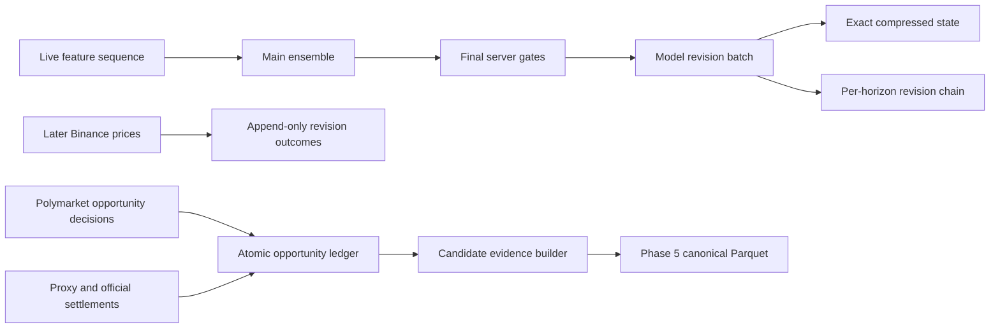

# Phase 5 Evidence Substrate

Date: 2026-08-02

## Decision

Phase 5B completed 46 frozen experiments and found zero promotion candidates. The next valid step
was not another trading model. It was forward evidence capable of answering why a forecast changed
and what happened to every evaluated opportunity.

This pass implements that evidence substrate. It does not authorize live orders and does not claim
profitability, accuracy improvement, or a new edge.

## Implemented

### 1. Continuous model-revision ledger

`backend/model_revision_ledger.py` creates `data/model_revision_ledger.duckdb` lazily when the
trained live ensemble first emits predictions.

Every completed prediction cycle stores:

- release ID, model ID, horizon and prediction timestamp;
- pre-server UP/DOWN/NEUTRAL model forecast and calibrated-confidence source;
- UP, DOWN and NEUTRAL probability vector;
- previous revision ID and previous prediction for the same release/model/horizon;
- exact Binance reference quote used by the cycle;
- aggregate output, distinct final trade-gated action, skip reasons, model weights and every
  base-model vote;
- every base model's DOWN/NEUTRAL/UP probability vector;
- one shared exact model-input snapshot for all horizons in the cycle.

The state snapshot stores the full 136-feature input passed into the ensemble, before its current
63-feature model-contract selection. Values are float32, zlib-compressed, hashed together with the feature-name list, and can
be decoded exactly. The snapshot is stored once, not duplicated for each horizon.

Outcomes are append-only in a separate table. The application records live Binance markouts at:

```text
1s, 5s, 15s, 30s, 60s, 120s, and each prediction's own horizon
```

The outcome includes target time, actual observation time, observation latency, price change,
actual direction and correctness. A missing observation remains missing. A price observed more
than ten seconds late is not backfilled as if it existed at the target time.

### 2. Canonical candidate-evidence builder

`backend/research_data/candidate_evidence_builder.py` exports the atomic opportunity ledger to:

```text
data/research/phase5_candidate_evidence.parquet
data/research/phase5_candidate_evidence.manifest.json
```

One row is one original decision. The builder uses only the decision ID to attach append-only
outcomes; there is no retrospective state/quote as-of join.

The dataset contains the Phase 5 contracts plus their provenance:

- decision, strategy, market, round and venue identity;
- exact feature values and their hash;
- exact model outputs and probability;
- exact bid, ask, fee and quote timestamps;
- selected action and skip reason;
- future markouts and selected settlement;
- realized gross PnL, fee and net PnL;
- model, calibrator, policy and feature hashes;
- resolved/economics-eligible flags.

Unresolved rows are retained for coverage. They are excluded from economic tests. ENTER PnL uses
the exact decision ask and fee. WAIT/BLOCKED/NO_QUOTE/UNAVAILABLE have zero selected-action PnL
after resolution because no position was opened. When an executable decision ask existed, the
builder also records a clearly labeled research-only ENTER counterfactual.

### 3. Consumer fail-closed behavior

Phase 5 candidate audits now automatically restrict economics to rows where:

```text
resolved = true
eligible_for_economics = true
```

The completeness test separately reports total, resolved and economic rows. Merely creating a
Parquet file with the right columns no longer makes the prerequisite appear complete.

## Runtime Flow



DuckDB writes run in a worker thread after the prediction cycle. They do not run inside WebSocket
callbacks and do not add another model inference pass.

## Operator Commands

No model retraining is required for this evidence change. Restarting the backend loads the code and
begins revision collection automatically.

After the opportunity ledger contains decisions and outcomes, export while the backend is stopped
or the source database is otherwise stable:

```powershell
& 'C:\Users\rahul\AppData\Local\Programs\Python\Python313\python.exe' `
  backend\research_data\candidate_evidence_builder.py
```

The exporter refuses to create a misleading empty evidence file. At implementation time the local
opportunity ledger had zero rows, so no production Parquet was fabricated.

Self-tests:

```powershell
python backend\model_revision_ledger.py --selftest
python backend\research_data\candidate_evidence_builder.py --selftest
```

## Still Blocked, Deliberately

### Same-time open-position action arms

HOLD/EXIT/REDUCE/SWITCH/LOCK cannot yet be declared complete. An honest row needs an identified
open position, both token books, executable depth at the same timestamp, inventory after partial
fills and fee rules. Retrospective later quotes are not a substitute.

Expected future artifact:

```text
data/research/open_position_action_paths.parquet
```

### 100/250/500ms and 1/2s execution stress

The model ledger's BTC markouts are forecast outcomes, not Polymarket execution outcomes. The
current recorder cannot guarantee paired executable books at all five latency targets. Phase 5B
experiment 88 therefore remains blocked rather than interpolating sub-second quotes.

Expected future artifact:

```text
data/research/phase5_candidate_latency_paths.parquet
```

### Atomic BTC event to paired Polymarket L2 join

This remains a separate recorder task. It requires one clock-domain contract, sequence-gap
tracking and both token books at the event instant. The candidate exporter does not invent it.

## Promotion Rules

Nothing in this pass changes Champion behavior. State diagnostics remain veto/router/exit research
inputs only. Promotion still requires at least eight forward weeks, 1,000 resolved actions,
after-cost economics, day/week robustness, matched controls and no causal or identity violations.

## Validation

Focused validation at implementation:

| Check | Result |
|---|---:|
| Python compile for changed modules | PASS |
| Model-revision ledger self-test | 9 checks passed |
| Candidate-evidence builder self-test | 7 checks passed |
| Exact float32 state round trip | PASS |
| Changed duplicate revision rejection | PASS |
| Future-state rejection | PASS |
| ENTER/WAIT counterfactual separation | PASS |
| Full pytest suite | 108 passed |
| Vite production build | PASS |
| Python compileall (`backend`, `research`) | PASS |

Both evidence self-tests are permanent invariant-workflow steps. The local full workflow completed
before this validation record was finalized; GitHub-hosted CI remains subject to the repository's
documented account/billing availability.
