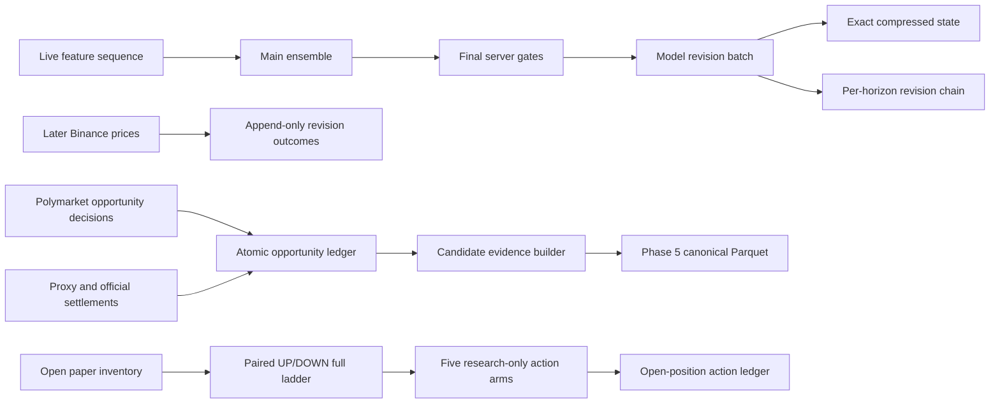

# Phase 5 Evidence Substrate

Date: 2026-08-02

## Decision

Phase 5B completed 46 frozen experiments and found zero promotion candidates. The next valid step
was not another trading model. It was forward evidence capable of answering why a forecast changed
and what happened to every evaluated opportunity.

This pass implements that evidence substrate. It does not authorize live orders and does not claim
profitability, accuracy improvement, or a new edge.

## Implemented

### 1. Continuous model-revision ledger

`backend/model_revision_ledger.py` creates `data/model_revision_ledger.duckdb` lazily when the
trained live ensemble first emits predictions.

Every completed prediction cycle stores:

- release ID, model ID, horizon and prediction timestamp;
- pre-server UP/DOWN/NEUTRAL model forecast and calibrated-confidence source;
- UP, DOWN and NEUTRAL probability vector;
- previous revision ID and previous prediction for the same release/model/horizon;
- exact Binance reference quote used by the cycle;
- aggregate output, distinct final trade-gated action, skip reasons, model weights and every
  base-model vote;
- every base model's DOWN/NEUTRAL/UP probability vector;
- one shared exact model-input snapshot for all horizons in the cycle.

The state snapshot stores the full 136-feature input passed into the ensemble, before its current
63-feature model-contract selection. Values are float32, zlib-compressed, hashed together with the feature-name list, and can
be decoded exactly. The snapshot is stored once, not duplicated for each horizon.

Outcomes are append-only in a separate table. The application records live Binance markouts at:

```text
1s, 5s, 15s, 30s, 60s, 120s, and each prediction's own horizon
```

The outcome includes target time, actual observation time, observation latency, price change,
actual direction and correctness. A missing observation remains missing. A price observed more
than ten seconds late is not backfilled as if it existed at the target time.

### 2. Canonical candidate-evidence builder

`backend/research_data/candidate_evidence_builder.py` exports the atomic opportunity ledger to:

```text
data/research/phase5_candidate_evidence.parquet
data/research/phase5_candidate_evidence.manifest.json
```

One row is one original decision. The builder uses only the decision ID to attach append-only
outcomes; there is no retrospective state/quote as-of join.

The dataset contains the Phase 5 contracts plus their provenance:

- decision, strategy, market, round and venue identity;
- exact feature values and their hash;
- exact model outputs and probability;
- exact bid, ask, fee and quote timestamps;
- selected action and skip reason;
- future markouts and selected settlement;
- realized gross PnL, fee and net PnL;
- model, calibrator, policy and feature hashes;
- resolved/economics-eligible flags.

Unresolved rows are retained for coverage. They are excluded from economic tests. ENTER PnL uses
the exact decision ask and fee. WAIT/BLOCKED/NO_QUOTE/UNAVAILABLE have zero selected-action PnL
after resolution because no position was opened. When an executable decision ask existed, the
builder also records a clearly labeled research-only ENTER counterfactual.

### 3. Consumer fail-closed behavior

Phase 5 candidate audits now automatically restrict economics to rows where:

```text
resolved = true
eligible_for_economics = true
```

The completeness test separately reports total, resolved and economic rows. Merely creating a
Parquet file with the right columns no longer makes the prerequisite appear complete.

### 4. Evidence health report

`backend/evidence_health_report.py` audits both evidence databases without changing predictions,
paper trades, model weights or promotion authority. Its default outputs are:

```text
data/reports/EVIDENCE_HEALTH_REPORT_V1.json
data/evidence_health.duckdb
```

The JSON file is replaced atomically. The DuckDB history is append-only so recorder degradation
can be inspected over time. The report includes:

- revision rows by horizon and release ID;
- resolved 1s/5s/15s/30s/60s/120s and per-horizon outcomes;
- missing-outcome rate after a 10-second maturity grace period;
- observation-latency median, p95, maximum and rate later than five seconds;
- changed-duplicate and causal refusal counts;
- predecessor-link and stored-causality checks;
- compressed-state decode, shape, finite-value and hash verification;
- opportunity rows by action, outcome kind and resolution state;
- duplicate/orphan opportunity outcomes and missing evaluated-action provenance.

An absent revision database or an empty opportunity ledger returns `WAITING_FOR_DATA`. It is never
reported as healthy. Corrupt state, future-dated stored inputs, broken predecessor links, orphan
outcomes or incomplete evaluated-action provenance return `FAIL`.

Refusals are append-only diagnostics in `model_revision_refusals`. An identical retry remains an
idempotent success and is not counted as a refusal. A same-ID/different-payload retry is counted as
`DUPLICATE_CONFLICT`; time-order violations are counted as `CAUSAL`. The telemetry records a
rejected attempt only and cannot weaken the ledger's original fail-closed behavior.

`backend/audit/recorder_evidence_check.py` is the companion process-level audit. It separates a
recorder that is merely wired/self-tested from one that has actually launched and written rows.
This matters for Binance sequenced L2: the implementation and launcher wiring exist, but the local
store has not yet been produced. Model/outcome health and recorder-process health remain separate
reports so neither can make the other appear healthy.

### 5. Same-time open-position action snapshots

`backend/open_position_action_recorder.py` creates:

```text
data/open_position_actions.duckdb
```

For every identified open `rule_paper_trades` position, the live price-to-beat path attempts a
capture every five seconds. One accepted capture contains the exact paper inventory, one atomic
paired UP/DOWN book already published by the canonical Polymarket recorder, both complete public
ladders, local receive times, venue timestamps when available, book hashes, fee metadata and the
current round context.

A snapshot is refused when it is future-dated, older than five seconds, missing either side,
invalid, crossed, inconsistent with its top of book, or when the two local receive timestamps are
more than one second apart. Invalid paper positions and unavailable-book attempts are stored in
separate append-only diagnostic tables instead of disappearing from the denominator.

Every accepted position snapshot records five research-only immediate action arms:

| Arm | Exact recorded mechanics |
|---|---|
| `HOLD` | No fill; preserve the current inventory. |
| `EXIT` | Sell all remaining UP and DOWN inventory through the recorded bid ladders. |
| `REDUCE_50` | Sell half of each remaining leg through the recorded bid ladders. |
| `SWITCH` | Sell the held one-sided inventory, then buy only the quantity actually sold on the opposite ask ladder. |
| `LOCK` | Buy the smaller side's inventory deficit so matched pairs have a guaranteed settlement floor. |

All ladder fills use `polymarket.l2_book.L2Book.execution_vwap`. The recorded crypto fee curve is
charged at every consumed level. Insufficient depth produces a partial fill and explicit residual
inventory; it is never upgraded to a complete fill. Entry cost is quantity-aware, action cash flow
has an explicit sign, and the guaranteed floor is stored separately from any expected outcome.

The action table does **not** select the best arm, update a model, alter a paper strategy or grant
capital authority. It is a forward counterfactual mechanics ledger. HOLD/SWITCH/partial-inventory
outcomes still require later official settlement and path evidence before the arms can be compared
economically.

## Runtime Flow



Model-revision DuckDB writes run in a worker thread after the prediction cycle. The bounded
open-position capture runs only from the Pyth price-to-beat tracker, never from a WebSocket
callback, and adds no model inference pass. It records existing paper inventory only; the Binance
mirror cannot create duplicate action snapshots.

## Operator Commands

No model retraining is required for this evidence change. Restarting the backend loads the code and
begins revision collection automatically.

After the opportunity ledger contains decisions and outcomes, export while the backend is stopped
or the source database is otherwise stable:

```powershell
& 'C:\Users\rahul\AppData\Local\Programs\Python\Python313\python.exe' `
  backend\research_data\candidate_evidence_builder.py
```

The exporter refuses to create a misleading empty evidence file. At implementation time the local
opportunity ledger had zero rows, so no production Parquet was fabricated.

Self-tests:

```powershell
python backend\model_revision_ledger.py --selftest
python backend\evidence_health_report.py --selftest
python backend\open_position_action_recorder.py --selftest
python backend\tests\test_open_position_action_wiring.py
python backend\audit\recorder_evidence_check.py --selftest
python backend\research_data\candidate_evidence_builder.py --selftest
```

Daily report after the backend has produced predictions:

```powershell
python backend\evidence_health_report.py --expect-live
```

Open-position recorder coverage while the backend is stopped:

```powershell
python backend\open_position_action_recorder.py --report
```

The report keeps separate counts for paired books, position snapshots, each action arm, partial
fills, failed capture attempts and malformed-position refusals. Zero rows means the runtime has
not yet observed both an open paper position and an admissible paired book.

Use `--full-state-scan` for a complete snapshot-integrity pass. The default checks the newest 1,000
snapshots to keep the daily command bounded. `--strict` returns a non-zero exit code unless the
overall status is exactly `HEALTHY`; do not use strict mode while an intentionally empty
opportunity ledger is still collecting. Because DuckDB file locking is process-scoped, run the CLI
while the backend is stopped or otherwise guarantee that the source files are stable.

Status meanings:

| Status | Meaning |
|---|---|
| `WAITING_FOR_DATA` | Required database/rows do not exist yet. This is not a pass. |
| `COLLECTING` | Rows exist but the declared minimum mature sample is not available. |
| `HEALTHY` | Declared coverage and integrity checks pass. This is not evidence of alpha. |
| `DEGRADED` | Missing, late or stale coverage exceeds a declared operational threshold. |
| `FAIL` | Stored evidence violates causality, identity, linkage or state integrity. |

## Still Blocked, Deliberately

### 100/250/500ms and 1/2s execution stress

The model ledger's BTC markouts are forecast outcomes, not Polymarket execution outcomes. The
current recorder cannot guarantee paired executable books at all five latency targets. Phase 5B
experiment 88 therefore remains blocked rather than interpolating sub-second quotes.

Expected future artifact:

```text
data/research/phase5_candidate_latency_paths.parquet
```

### Atomic BTC event to paired Polymarket L2 join

This remains a separate recorder task. It requires one clock-domain contract, sequence-gap
tracking and both token books at the event instant. The candidate exporter does not invent it.

## Promotion Rules

Nothing in this pass changes Champion behavior. State diagnostics remain veto/router/exit research
inputs only. Promotion still requires at least eight forward weeks, 1,000 resolved actions,
after-cost economics, day/week robustness, matched controls and no causal or identity violations.

## Validation

Focused validation at implementation:

| Check | Result |
|---|---:|
| Python compile for changed modules | PASS |
| Model-revision ledger self-test | 11 checks passed |
| Evidence-health report self-test | 12 checks passed |
| Open-position action recorder self-test | 18 checks passed |
| Live action-recorder wiring test | PASS |
| Candidate-evidence builder self-test | 7 checks passed |
| Exact float32 state round trip | PASS |
| Changed duplicate revision rejection | PASS |
| Future-state rejection | PASS |
| ENTER/WAIT counterfactual separation | PASS |
| Full local invariant workflow | 102/102 passed |
| Full pytest suite | 109 passed |
| Vite production build | PASS |
| npm high-severity audit | 0 vulnerabilities |
| Python compileall (`backend`, `research`) | PASS |

The evidence self-tests are permanent invariant-workflow steps. The local full workflow completed
before this validation record was finalized; GitHub-hosted CI remains subject to the repository's
documented account/billing availability.
