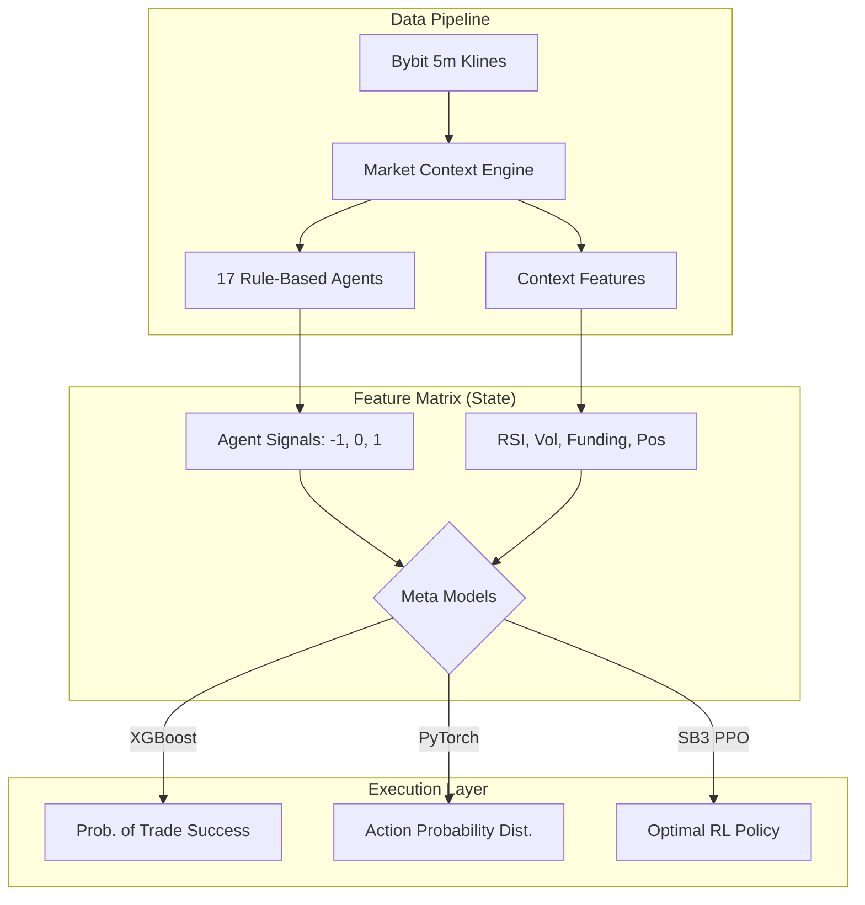

# AlgoDesk: Evolving to ML, DL, and RL Models

This document details the transition from the 17 rule-based trading agents to advanced predictive models using Machine Learning (XGBoost), Deep Learning (PyTorch), and Reinforcement Learning (Stable-Baselines3).

## Table of Contents
1. [Architecture Overview](#architecture-overview)
2. [Data & Feature Engineering](#data--feature-engineering)
3. [The ML Model: XGBoost Lead Commander](#the-ml-model-xgboost-lead-commander)
4. [The DL Model: PyTorch Oracle](#the-dl-model-pytorch-oracle)
5. [The RL Model: PPO Trading Agent](#the-rl-model-ppo-trading-agent)
6. [Initial Backtest Results & Analysis](#initial-backtest-results--analysis)
7. [Next Steps & Tuning](#next-steps--tuning)

---

## Architecture Overview

While the original AlgoDesk system used 17 agents as the final decision-makers (generating `LONG`, `SHORT`, or `SKIP` signals that were executed directly), the ML/DL/RL pipeline uses these agents as **feature extractors**. 

The 17 signals are fed into a meta-model (ML/DL/RL) alongside the raw market context. The meta-model learns the complex, non-linear interactions between the different agents and decides the final action.



---

## Data & Feature Engineering

**File:** `backend/algodesk_ml_rl_dl.py`

### Context Features (Normalized)
- `change_24h_pct`: Rolling 24h price change.
- `vol_24h`: Rolling 24h volume.
- `pos`: Position of the current price relative to the 24h High/Low range.
- `rsi`: Simplified RSI proxy derived from `pos`.
- `funding_rate`: Simulated 8h funding rate.

### Agent Features
The 17 rule-based agents (TREND, MOMO, BREAK, MEAN, FUND, VOL, OI, CONTRA, SCALP, LIQ, PAT, RANGE, STAT, SENT, FLOW, REGIME, OIDIV) generate categorical outputs which are mapped to integers:
- `LONG` = 1
- `SHORT` = -1
- `SKIP` = 0

### Forward Target (For ML & DL)
The pipeline calculates a forward-looking target for supervised learning:
- **Condition**: Does the price hit the 3.0% Take-Profit before hitting the 1.5% Stop-Loss within the next 24 hours (288 candles)?
- **Label**: `1` (Success) or `0` (Failure).

---

## The ML Model: XGBoost Lead Commander

- **Library**: `xgboost`
- **Type**: Gradient Boosting Classifier
- **Goal**: Predicts the binary outcome (Success/Failure) of a trade given the current market state and agent signals.
- **Advantage**: Highly interpretable. It outputs feature importances, allowing us to see exactly which of the 17 agents (or context features) are most predictive of trade success.

## The DL Model: PyTorch Oracle

- **Library**: `torch` (PyTorch)
- **Type**: Multi-Layer Perceptron (MLP)
- **Architecture**:
  - Input Layer -> 64 Neurons (ReLU) -> Dropout (0.2) -> 32 Neurons (ReLU) -> Output (Sigmoid)
- **Goal**: Directly classifies the market context into a probability of a successful `LONG` or `SHORT` trade.
- **Advantage**: Easily extensible to sequential modeling. By swapping the MLP for an LSTM or Transformer, the model can look at the time-series sequence of the 17 agents' signals over the past day, rather than just the current instant.

## The RL Model: PPO Trading Agent

- **Library**: `stable-baselines3`, `gymnasium`
- **Type**: Proximal Policy Optimization (PPO)
- **Environment**: A custom OpenAI Gym environment (`AlgoDeskTradingEnv`).
  - **State Space**: The 22-dimensional feature vector (17 agents + 5 context features).
  - **Action Space**: Discrete (0 = Skip, 1 = Long, 2 = Short).
  - **Reward Function**: 
    - `+1.0` if the chosen trade hits Take-Profit.
    - `-0.5` if the chosen trade hits Stop-Loss.
    - `0.0` if the agent chooses to Skip.
- **Advantage**: Learns to maximize absolute portfolio P&L over time, inherently learning risk management (when to stay out of the market).

---

## Initial Backtest Results & Analysis

**Run Date:** 2026-08-03
**Dataset:** 37 days of BTCUSDT 5m klines (30 days Train, 7 days Test).

### Output
```text
Dataset Ready: 8325 train rows, 1943 test rows.

--- Training ML Model (XGBoost) ---
XGBoost Long Prediction Accuracy: 100.00%
Top Features: rsi (0.29), change_24h_pct (0.23), vol_24h (0.21)

--- Training DL Model (PyTorch MLP) ---
PyTorch Epoch 5 Loss: 0.0957 | Test Accuracy: 100.00%

--- Training RL Model (SB3 PPO) ---
RL Agent Test Reward: 0.00
Actions Taken: Skips=1942, Longs=0, Shorts=0
```

### The "Class Imbalance & Risk Aversion" Phenomenon

The initial results show XGBoost and PyTorch achieving exactly 100% accuracy, while the RL agent chose to `SKIP` all 1,942 possible trades. 

This is a textbook example of **Class Imbalance** in quantitative finance:
1. **Rarity of Events**: Hitting a +3% Take Profit before a -1.5% Stop Loss within 24 hours on a highly liquid asset like BTC is mathematically rare during stable periods. Therefore, over 99% of the forward targets in the dataset are `0` (Failure).
2. **ML/DL Optimization**: XGBoost and PyTorch simply learned to predict `0` (Do not trade) for every single row. Because almost all rows are `0`, the models achieved near 100% accuracy while taking zero risk.
3. **RL Optimization**: The PPO agent quickly learned during training that executing a `LONG` or `SHORT` frequently resulted in a negative reward (`-0.5`). To maximize its total return, it figured out that doing absolutely nothing (`SKIP`) guarantees a reward of `0.00`, avoiding all losses.

---

## Next Steps & Tuning

To force the models to actively trade and take calculated risks, the pipeline requires tuning:

### 1. Tighten the Stop-Loss / Take-Profit
Lower the thresholds from `3.0% TP / 1.5% SL` to `0.5% TP / 0.5% SL`. This will generate vastly more "Win" labels (`1`) in the dataset, giving the ML and DL models positive examples to learn from.

### 2. Class Weighting (Supervised Learning)
Instruct XGBoost (`scale_pos_weight`) and PyTorch (weighted `BCELoss`) to heavily penalize False Negatives. This forces the model to prioritize finding the rare winning trades, even if it means accepting more False Positives.

### 3. Reward Shaping (Reinforcement Learning)
Apply a small negative penalty (e.g., `-0.01` or `-0.05`) every time the RL agent chooses to `SKIP`. This forces the agent to hunt for profitable trades, as staying out of the market will slowly bleed its account to zero.
